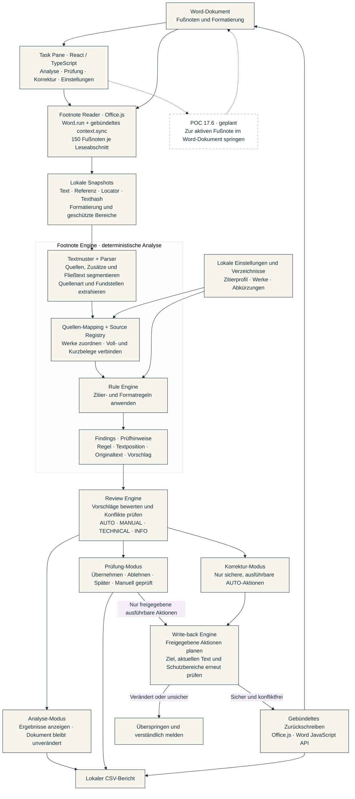
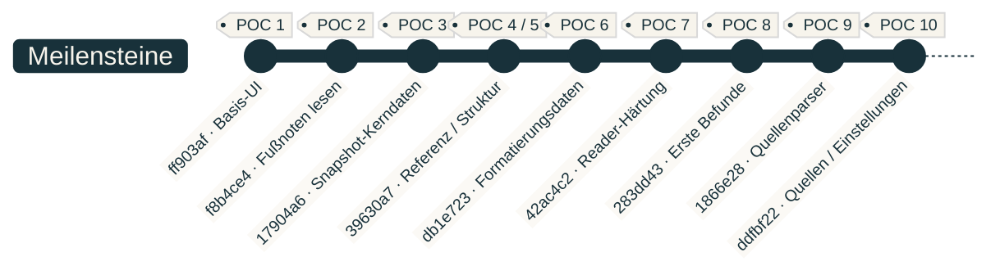
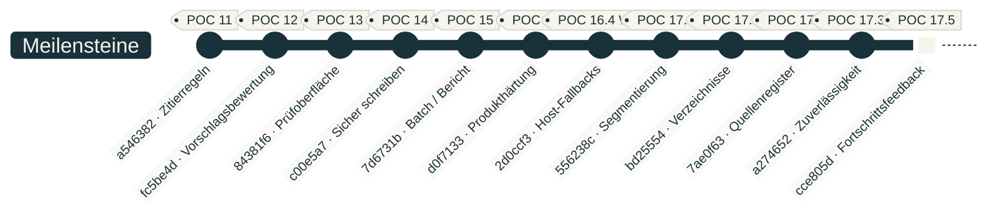

<div align="center">
  
  <h1>Footnote-Checker</h1>
  <p><strong>Juristische Fußnoten prüfen. Quellen konsistent zitieren. Sicher korrigieren.</strong></p>
  <p>FNC · Word-Add-in · deutsche Zitierpraxis · Beta</p>
  
  <p><a href="#installation">Installation</a> · <a href="#so-funktioniert-fnc">Bedienung</a> · <a href="docs/INSTALLATION.md">Ausführliche Anleitung</a> · <a href="https://github.com/AfsharLT/footnote-checker/issues">Feedback</a></p>
</div>

## Was macht FNC?

Footnote-Checker unterstützt die formale Prüfung juristischer Fußnoten direkt in Microsoft Word. Es erkennt Zitierbestandteile, prüft sie nach konfigurierbaren Regeln und zeigt nachvollziehbare Korrekturvorschläge.

- **Zitierweise prüfen:** Interpunktion, Abkürzungen, Seiten-/Randnummernangaben und Formatierung.
- **Quellen unterscheiden:** Gesetze, Rechtsprechung, Kommentare, Bücher und Zeitschriften; die 17.3-Erweiterung erkennt zusätzlich unter anderem Festschriftbeiträge. Einzelne Festschrift-Regeln befinden sich noch in der Beta-Prüfung.
- **Konsistenz herstellen:** Werkbezeichnungen, alternative Schreibweisen, Kurzbelege und dokumentbezogene Quellenzuordnung.
- **Kontrolliert korrigieren:** Einzelentscheidungen oder sichere gebündelte Korrekturen. Unsichere Stellen bleiben zur manuellen Prüfung offen.
- **Ergebnisse weitergeben:** CSV-Bericht sowie Import/Export der Einstellungen und Quellenverwaltung.

FNC arbeitet regelbasiert. Es ersetzt keine fachliche Prüfung und verifiziert derzeit weder die Existenz einer Quelle noch, ob sie eine Aussage inhaltlich belegt. KI-gestützte Quellenprüfung ist ein späteres Entwicklungsthema.

## Installation

**Beta für Word Desktop auf macOS und Windows.** Internetzugang ist nötig: Die Pakete richten Word ein, die Oberfläche wird anschließend vom gehosteten Dienst geladen. Für Anwender sind weder Node.js noch VS Code erforderlich.

| System | Download | Einstieg |
| --- | --- | --- |
| macOS | [Mac-Betapaket herunterladen](https://github.com/AfsharLT/footnote-checker/raw/refs/heads/main/downloads/Footnote-Checker-macOS-Beta.zip) | Entpacken → Word beenden → Mac-Installer öffnen |
| Windows | [Windows-Betapaket herunterladen](https://github.com/AfsharLT/footnote-checker/raw/refs/heads/main/downloads/Footnote-Checker-Windows-Beta.zip) | Entpacken → Word beenden → Windows-Installer starten |

Bei einem privaten Repository ist GitHub-Zugriff für die Downloads erforderlich. Die Pakete laden die jeweils gehostete Beta; ein GitHub-Update aktualisiert diesen Dienst nicht automatisch. Die ZIP-Dateien enthalten das Produktionsmanifest und die vollständige Anleitung. [Paketinhalte und Prüfsummen](downloads/README.md).

### macOS – Schritt für Schritt

1. Mac-Paket herunterladen und vollständig entpacken.
2. Word mit **⌘Q** beenden; ein geschlossenes Dokumentfenster genügt nicht.
3. `install-footnote-checker-mac.command` öffnen. Das Script kopiert ausschließlich das Manifest in den Word-Add-in-Ordner und sichert eine vorhandene gleichnamige Datei. Es benötigt keine Administratorrechte.
4. Word erneut öffnen und ein Dokument laden. Unter **Start → Add-Ins** den **Footnote-Checker** auswählen; je nach Word-Version über **Weitere Add-Ins / Meine Add-Ins**.
5. Zuerst eine Dokumentkopie im Modus **Analyse** prüfen.

**Mac blockiert das Script?** Verwende alternativ die manuelle Installation per Finder: **⇧⌘G** → `~/Library/Containers/com.microsoft.Word/Data/Documents/wef` → `manifest.production.xml` dorthin kopieren → Word neu starten. Fehlt `wef`, den Ordner anlegen. Ist nur die Ausführungsberechtigung verloren gegangen, hilft der in der [Anleitung](docs/INSTALLATION.md#macos-probleme-lösen) erläuterte `chmod`-Befehl. Gatekeeper, Berechtigungen und Cache-Probleme sind dort separat erklärt. [Microsofts Mac-Anleitung](https://learn.microsoft.com/en-us/office/dev/add-ins/testing/sideload-an-office-add-in-on-mac).

### Windows – Schritt für Schritt

1. Windows-Paket herunterladen und vollständig entpacken.
2. Word schließen; `install-footnote-checker-windows.bat` als eigener Windows-Benutzer starten.
3. Die Administratorabfrage nur mit demselben Benutzerkonto bestätigen. Das Script richtet einen lokalen Katalog, eine auf dieses Konto beschränkte Ordnerfreigabe und einen vertrauenswürdigen Office-Katalog ein.
4. Word öffnen → **Start → Add-Ins → Erweitert → Freigegebener Ordner** → **Footnote-Checker → Hinzufügen**.
5. Auf verwalteten Hochschul-/Arbeitsrechnern bei gesperrten Freigaben, Scripts oder Add-ins die IT einbeziehen. Die [Anleitung](docs/INSTALLATION.md#windows) enthält den manuellen Katalogweg.

Die Windows-Kataloginstallation ist ein Testverfahren, keine fertige Marketplace-Distribution. [Microsofts Katalog-Anleitung](https://learn.microsoft.com/en-us/office/dev/add-ins/testing/create-a-network-shared-folder-catalog-for-task-pane-and-content-add-ins).

## So funktioniert FNC

1. **Dokumentkopie öffnen** und FNC starten.
2. **Zitiereinstellungen und Literaturverzeichnis** bei Bedarf anpassen.
3. **Fußnoten prüfen** starten.
4. Den passenden Modus nutzen:

| Modus | Verhalten |
| --- | --- |
| Analyse | Zeigt Befunde, ohne das Dokument zu verändern. |
| Prüfung | Vorschläge einzeln übernehmen, ablehnen oder zurückstellen; freigegebene Änderungen ausführen. |
| Korrektur | Führt ausschließlich sichere, ausführbare und konfliktfreie automatische Korrekturen aus. |

Hinweise, unklare Quellen und technisch nicht sicher bearbeitbare Stellen bleiben zur Prüfung offen. Nach Änderungen erneut analysieren und den CSV-Bericht bei Bedarf exportieren.

## Technischer Workflow

Die **Task Pane** ist die Seitenleiste in Word. Sie startet die Prüfung und zeigt Ergebnisse und Entscheidungen. Der folgende Ablauf entspricht der aktuellen Architektur; gestrichelte Verbindungen markieren geplante Erweiterungen.



- **Reader / Snapshot:** Office.js liest Word-Daten gebündelt. Ein Snapshot ist eine lokale Momentaufnahme einer Fußnote. Der **Locator** beschreibt ihre Position; der **Texthash** ist ein Fingerabdruck, mit dem FNC spätere Änderungen erkennt. Word-Objekte werden nicht als dauerhaft gespeicherte Daten weitergereicht.
- **Parser / Regeln:** Textmuster erkennen etwa `Rn. 12`; der Parser ordnet dies einer Quelle und Fundstelle zu. Das Mapping identifiziert hinterlegte Werke, die dokumentbezogene Source Registry verbindet Kurzbelege mit früheren Quellen. Deterministische Regeln ergeben bei gleichen Daten und Einstellungen dieselben Befunde.
- **Review / Write-back:** Die Review Engine unterscheidet automatisch bearbeitbare, manuell zu prüfende, technisch blockierte und informative Hinweise. Eine manuelle Prüfbestätigung löst keine unsichere Textänderung aus. Vor dem Schreiben prüft FNC das aktuelle Word-Ziel erneut; geänderte oder geschützte Stellen werden übersprungen.
- **Fortschritt / Speicher:** POC 17.5 zeigt echte Verarbeitungszähler und verständliche Phasen. Die lokale Analyse gibt der Oberfläche zwischen kurzen Arbeitsabschnitten Zeit zum Aktualisieren. Einstellungen bleiben im jeweiligen lokalen Add-in-Profil; es gibt keine gemeinsame Servereinstellung. Eine KI-/LLM-Prüfung ist derzeit nicht Teil dieses Ablaufs.

## Entwicklungsstand

Stand im Repository: **1. Oktober 2026**. POC 17.5 ist implementiert und committed; die reale Word-Prüfung steht noch aus. POC 17.6 ist geplant. Repository, gehostete Beta und tatsächliche Word-Validierung haben jeweils einen eigenen Stand.

### POC 1–17: Kategorien und Meilensteine

Die Commitlinks führen zum tatsächlichen Codestand. Für mehrteilige POCs ist ein repräsentativer Abschlussstand angegeben; Datum = Datum des jeweiligen Git-Commits.

| POC | Kurzname | Kategorie | Ergebnis | Datum / Commit |
| --- | --- | --- | --- | --- |
| 1 | Basis-UI | Task Pane | Word-Seitenleiste und Startoberfläche. | 15.08.2026 · [ff903af](https://github.com/AfsharLT/footnote-checker/commit/ff903af) |
| 2 | Fußnoten lesen | Reader | Word-Fußnoten über Office.js auslesen. | 15.08.2026 · [f8b4ce4](https://github.com/AfsharLT/footnote-checker/commit/f8b4ce4) |
| 3 | Snapshot-Kerndaten | Reader | Text, Reihenfolge, Anzeige und Texthash erfassen. | 15.08.2026 · [17904a6](https://github.com/AfsharLT/footnote-checker/commit/17904a6) |
| 4 | Referenz / Locator | Reader | Referenz und beschreibbares Word-Ziel; im POC-5-Commit enthalten. | 16.08.2026 · [39630a7](https://github.com/AfsharLT/footnote-checker/commit/39630a7) |
| 5 | Fußnotenstruktur | Reader | Absätze, Hyperlinks und schlanker Locator. | 16.08.2026 · [39630a7](https://github.com/AfsharLT/footnote-checker/commit/39630a7) |
| 6 | Formatierungsdaten | Reader | Zeichen- und Absatzformatierung zuverlässig erfassen. | 16.08.2026 · [db1e723](https://github.com/AfsharLT/footnote-checker/commit/db1e723) |
| 7 | Reader-Härtung | Reader | Felder, Schutzbereiche, Textpositionen und große Dokumente. | 16.08.2026 · [42ac4c2](https://github.com/AfsharLT/footnote-checker/commit/42ac4c2) |
| 8 | Erste Befunde | Footnote Engine | Prüfhinweise, Textmuster, URL-Schutz und erste Regel. | 17.08.2026 · [283dd43](https://github.com/AfsharLT/footnote-checker/commit/283dd43) |
| 9 | Quellenparser | Footnote Engine | Zitate segmentieren, Quellenarten und Fundstellen extrahieren. | 18.08.2026 · [1866e28](https://github.com/AfsharLT/footnote-checker/commit/1866e28) |
| 10 | Quellen / Einstellungen | Footnote Engine | Zitierprofile, persistentes Werk-Mapping und Einstellungsoberfläche. | 20.08.2026 · [ddfbf22](https://github.com/AfsharLT/footnote-checker/commit/ddfbf22) |
| 11 | Zitierregeln | Footnote Engine | Deterministisches Regelwerk und Quellenkonsistenz. | 21.08.2026 · [a546382](https://github.com/AfsharLT/footnote-checker/commit/a546382) |
| 12 | Vorschlagsbewertung | Review Engine | Sichere, unsichere, informative und technisch blockierte Vorschläge unterscheiden. | 22.08.2026 · [fc5be4d](https://github.com/AfsharLT/footnote-checker/commit/fc5be4d) |
| 13 | Prüfoberfläche | Review / UI | Analyse, Prüfung und Korrektur mit nutzbaren Entscheidungen. | 23.08.2026 · [84381f6](https://github.com/AfsharLT/footnote-checker/commit/84381f6) |
| 14 | Sicher schreiben | Write-back | Einzeländerungen mit erneuter Ziel- und Textprüfung. | 23.08.2026 · [c00e5a7](https://github.com/AfsharLT/footnote-checker/commit/c00e5a7) |
| 15 | Batch / Bericht | Write-back | Gebündelte Korrekturen und CSV-Bericht. | 23.08.2026 · [7d6731b](https://github.com/AfsharLT/footnote-checker/commit/7d6731b) |
| 16 | Produkthärtung | Kompatibilität | Performance, Host-Fallbacks, UI-Härtung und Produktionsgrundlage. | 26.08.2026 · [d0f7133](https://github.com/AfsharLT/footnote-checker/commit/d0f7133) |
| 17 | Quellen / UX | Engine / Produkt | Segmentierung, Quellenregister, Verzeichnisse, Quellentypen und Fortschrittsanzeige. | 16.09.–01.10.2026 · zuletzt [cce805d](https://github.com/AfsharLT/footnote-checker/commit/cce805d) |

**POC 4 hat keinen eigenständig benannten Commit im vorhandenen Verlauf.** Seine Referenz-/Locator-Strukturen sind im POC-5-Stand nachweisbar; deshalb teilen beide denselben Commitlink.

### Git-Verlauf von links nach rechts

Zwei aufeinanderfolgende Ausschnitte derselben Entwicklungslinie, mit POC-Nummer, Kurzname und echtem Commit. Die Zweiteilung hält die Beschriftungen lesbar. Die Grafik fasst Meilensteine zusammen; sie zeigt keine vollständige Branch-/Merge-Historie. Die POC-Labels sind Diagrammbeschriftungen, keine zusätzlich angelegten Git-Tags. Datumsangaben stehen in der Tabelle.

**Teil 1 · Oberfläche und Reader → Quellenanalyse**



**Teil 2 · Regelwerk und sichere Änderungen → POC 17.5**



POC 17.4 wurde vor 17.2 umgesetzt; der Graph folgt den tatsächlichen Commits. Die spätere POC-16.4-Integration nach `main` erfolgte mit `bf75519`. Syntax: [Mermaid GitGraph](https://mermaid.js.org/syntax/gitgraph.html).

### POC 17 im Detail und Ausblick

| POC | Schwerpunkt | Stand |
| --- | --- | --- |
| 17.1 | Segmentierung und Review-Härtung | Implementiert: einzelne Quellen, Zusätze und Fließtext getrennt behandeln. |
| 17.2 / 17.2.2 / 17.2.3 | Quellenregister und Kurzbelege | Implementiert: Rückverweise und Varianten konservativ zuordnen. |
| 17.3 / 17.3.2 | Quellenabdeckung und Zuverlässigkeit | Implementierter Stand committed; reale Hassemer-/Hruschka-Festschrift-Pinpoints laut CTO-Chat weiter offen. |
| 17.4 | Einstellungen und Verzeichnisse | Vorgezogen und implementiert. |
| **17.5** | **Lade- und Fortschrittsfeedback** | **Implementiert, committed und automatisiert geprüft; reale Word-Validierung offen.** Phasen, echte Zähler, aktive Warteanzeige, Nach-oben-Button und neues Logo. |
| **17.6** | **Word-Fußnotennavigation** | **Geplant, noch nicht implementiert:** optional aus dem Checker zur zuletzt geöffneten und noch aktiven Fußnote im Word-Dokument springen. |
| 17.7 | Festschrift-Regeln und Quellenpflege | Vorgemerkt: offene Pinpoint-Fälle und Festschrift-Auswahl/Filter im Literaturverzeichnis. |

```mermaid
%%{init: {'theme': 'base', 'themeVariables': {'primaryColor': '#F7F4EC', 'primaryTextColor': '#18313A', 'primaryBorderColor': '#18313A', 'lineColor': '#18313A'}}}%%
flowchart LR
    Current["17.5 · Fortschrittsfeedback<br/>Implementiert · Word-Test offen"]
    Navigation["17.6 · Fußnotennavigation<br/>Geplant"]
    Festschrift["17.7 · Festschrift-Regeln<br/>Vorgemerkt"]
    Similarity["18 · Quellenähnlichkeit<br/>Geplant"]
    Import["19 · Bulk-Import / Export<br/>Geplant"]
    AI["20 · Kontrollierte KI<br/>Geplant"]
    Current -.-> Navigation -.-> Festschrift -.-> Similarity -.-> Import -.-> AI
    classDef planned fill:#ffffff,stroke:#E88B72,stroke-dasharray:5 5,color:#18313A;
    class Navigation,Festschrift,Similarity,Import,AI planned;
```



Die gestrichelte Roadmap beschreibt die weitere Planung. **Für 17.6 existiert noch kein Implementierungscommit.** Diese Funktionen sind noch keine Produktzusagen. Der Repository-Stand enthält das neue FNC-Logo und die dezenten Petrol-Akzente auf weißem Hintergrund aus 17.5; der gehostete Dienst wurde damit noch nicht aktualisiert. [17.5-Abschlussbericht und Word-Testanleitung](docs/POC_17_5_VALIDATION.md).

## Entwicklung und Validierung

React · TypeScript · Office.js · Webpack · Cloudflare Workers Static Assets. Große Dokumente werden gebündelt verarbeitet; unsichere Dokumentbereiche werden geschützt.

Mit einer aktuellen Node.js-LTS-Version und npm im Repository arbeiten. Die vorhandenen Scripts verwenden aktuelle Werkzeuge; Node 24 wurde bei dieser Vorbereitung eingesetzt.

```bash
npm ci
npm start
```

`npm ci` installiert die im Lockfile festgelegten Abhängigkeiten und ersetzt vorhandene `node_modules`. `npm start` startet die lokale Word-Entwicklungsinstallation, kann lokale Entwicklungszertifikate einrichten und Word öffnen. Erfolg: Das lokale Add-in lädt von `https://localhost:3000`. Beenden mit `npm stop`; dabei wird die Entwicklungsinstallation gestoppt. Die Beta-Pakete verwenden dagegen die gehostete URL.

Nach Änderungen:

```bash
npm run typecheck
npm run lint
npm test
npm run build
npm run validate
git diff --check
```

Die Befehle prüfen Typen, Codequalität, Tests, Produktionsbuild, Entwicklungsmanifest und Whitespace. Mapping-Generierung und Build schreiben generierte Dateien; diese Änderungen ebenfalls prüfen. Erfolg: Alle Checks enden mit Exit-Code 0. Das Produktionsmanifest zusätzlich mit `npx --no-install office-addin-manifest validate manifest.production.xml` prüfen; das prüft die XML-Konfiguration, nicht die Word-Laufzeit.

**Ein erfolgreicher Build genügt nicht.** Reale Word-Prüfung auf macOS und Windows, bei relevanten Änderungen auf älteren Hosts und mit großen Dokumenten durchführen. [Freigabecheckliste für 17.3.2 und die neuen Pakete](docs/RELEASE_PREPARATION.md).

## Daten, Beta und Feedback

Die Analyse läuft im Add-in regelbasiert; Einstellungen und Quellenverwaltung werden lokal im Add-in-Speicher abgelegt. Die Weboberfläche und Office.js werden über das Internet geladen. Der lokale Speicher ist kein dokumentübergreifend synchronisiertes Konto: Vor Rechnerwechsel oder Cachebereinigung Einstellungen exportieren. Eine verbindliche Datenschutzinformation für öffentliche Distribution ist noch zu finalisieren.

Für Fehlermeldungen bitte Word-Version, Betriebssystem, Schritte und einen anonymisierten Beispielbeleg angeben. [Issue erstellen](https://github.com/AfsharLT/footnote-checker/issues). Keine vertraulichen Dokumente öffentlich hochladen.

Die Beta ist noch kein Microsoft-Marketplace-Angebot. Lizenzdatei, Datenschutzhinweise und Distributionsprüfung sind vor einer öffentlichen Freigabe zu finalisieren; das `MIT`-Feld aus dem ursprünglichen Projektgerüst ersetzt keine geprüfte Lizenzdatei.
