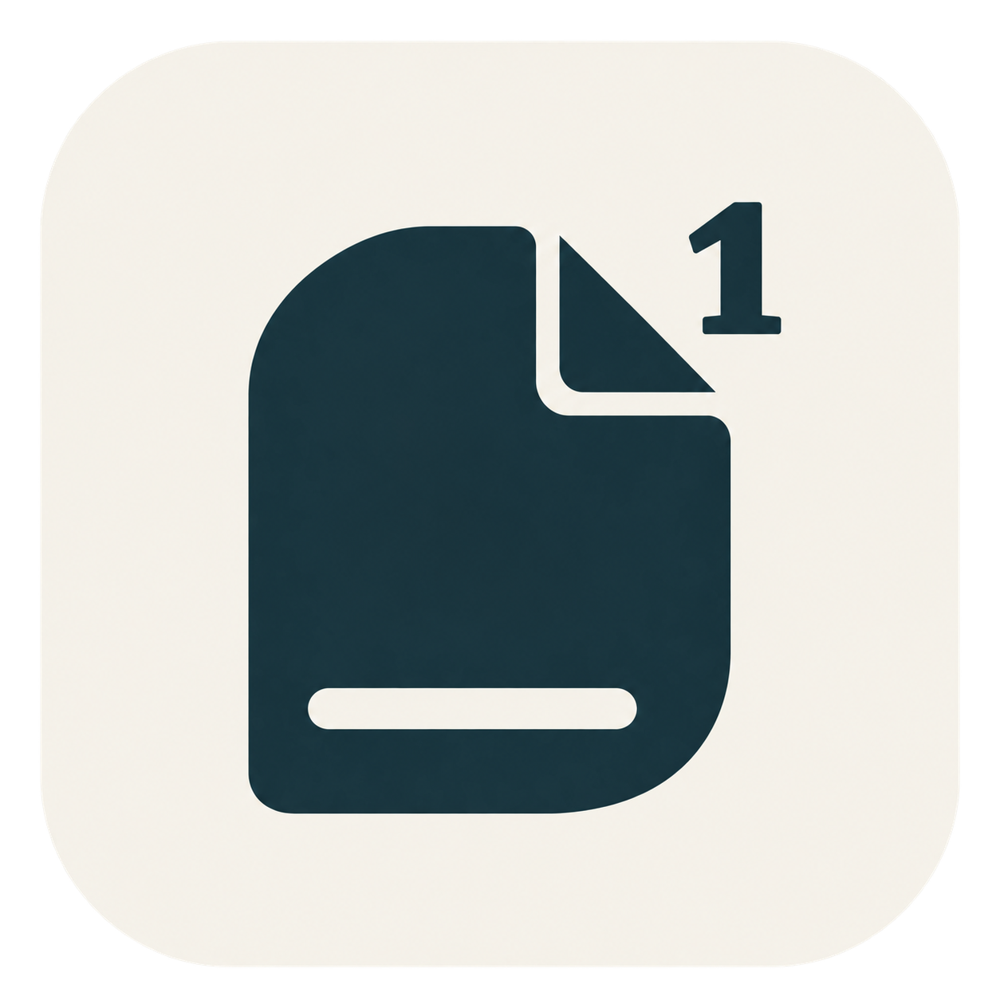
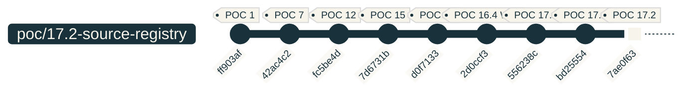

<div align="center">
  
  <h1>Footnote-Checker</h1>
  <p><strong>Juristische Fußnoten prüfen. Quellen konsistent zitieren. Sicher korrigieren.</strong></p>
  <p>FNC · Word-Add-in · deutsche Zitierpraxis · Beta</p>
  
  <p><a href="#installation">Installation</a> · <a href="#so-funktioniert-fnc">Bedienung</a> · <a href="docs/INSTALLATION.md">Ausführliche Anleitung</a> · <a href="https://github.com/AfsharLT/footnote-checker/issues">Feedback</a></p>
</div>

## Was macht FNC?

Footnote-Checker unterstützt die formale Prüfung juristischer Fußnoten direkt in Microsoft Word. Es erkennt Zitierbestandteile, prüft sie nach konfigurierbaren Regeln und zeigt nachvollziehbare Korrekturvorschläge.

- **Zitierweise prüfen:** Interpunktion, Abkürzungen, Seiten-/Randnummernangaben und Formatierung.
- **Quellen unterscheiden:** Gesetze, Rechtsprechung, Kommentare, Bücher und Zeitschriften; die lokale 17.3-Erweiterung ergänzt unter anderem Festschriftbeiträge.
- **Konsistenz herstellen:** Werkbezeichnungen, alternative Schreibweisen, Kurzbelege und dokumentbezogene Quellenzuordnung.
- **Kontrolliert korrigieren:** Einzelentscheidungen oder sichere gebündelte Korrekturen. Unsichere Stellen bleiben zur manuellen Prüfung offen.
- **Ergebnisse weitergeben:** CSV-Bericht sowie Import/Export der Einstellungen und Quellenverwaltung.

FNC arbeitet regelbasiert. Es ersetzt keine fachliche Prüfung und verifiziert derzeit weder die Existenz einer Quelle noch, ob sie eine Aussage inhaltlich belegt. KI-gestützte Quellenprüfung ist ein späteres Entwicklungsthema.

## Installation

**Beta für Word Desktop auf macOS und Windows.** Internetzugang ist nötig: Die Pakete richten Word ein, die Oberfläche wird anschließend vom gehosteten Dienst geladen. Für Anwender sind weder Node.js noch VS Code erforderlich.

| System | Download | Einstieg |
| --- | --- | --- |
| macOS | [Mac-Betapaket herunterladen](https://github.com/AfsharLT/footnote-checker/raw/refs/heads/main/downloads/Footnote-Checker-macOS-Beta.zip) | Entpacken → Word beenden → Mac-Installer öffnen |
| Windows | [Windows-Betapaket herunterladen](https://github.com/AfsharLT/footnote-checker/raw/refs/heads/main/downloads/Footnote-Checker-Windows-Beta.zip) | Entpacken → Word beenden → Windows-Installer starten |

Die Links werden verfügbar, sobald diese Dateien nach `main` gepusht wurden; bei einem privaten Repository ist GitHub-Zugriff erforderlich. Die ZIP-Dateien enthalten das Produktionsmanifest und die vollständige Anleitung. [Paketinhalte und Prüfsummen](downloads/README.md).

### macOS – Schritt für Schritt

1. Mac-Paket herunterladen und vollständig entpacken.
2. Word mit **⌘Q** beenden; ein geschlossenes Dokumentfenster genügt nicht.
3. `install-footnote-checker-mac.command` öffnen. Das Script kopiert ausschließlich das Manifest in den Word-Add-in-Ordner und sichert eine vorhandene gleichnamige Datei. Es benötigt keine Administratorrechte.
4. Word erneut öffnen und ein Dokument laden. Unter **Start → Add-Ins** den **Footnote-Checker** auswählen; je nach Word-Version über **Weitere Add-Ins / Meine Add-Ins**.
5. Zuerst eine Dokumentkopie im Modus **Analyse** prüfen.

**Mac blockiert das Script?** Verwende alternativ die manuelle Installation per Finder: **⇧⌘G** → `~/Library/Containers/com.microsoft.Word/Data/Documents/wef` → `manifest.production.xml` dorthin kopieren → Word neu starten. Fehlt `wef`, den Ordner anlegen. Ist nur die Ausführungsberechtigung verloren gegangen, hilft der in der [Anleitung](docs/INSTALLATION.md#macos-probleme-lösen) erläuterte `chmod`-Befehl. Gatekeeper, Berechtigungen und Cache-Probleme sind dort separat erklärt. [Microsofts Mac-Anleitung](https://learn.microsoft.com/en-us/office/dev/add-ins/testing/sideload-an-office-add-in-on-mac).

### Windows – Schritt für Schritt

1. Windows-Paket herunterladen und vollständig entpacken.
2. Word schließen; `install-footnote-checker-windows.bat` als eigener Windows-Benutzer starten.
3. Die Administratorabfrage nur mit demselben Benutzerkonto bestätigen. Das Script richtet einen lokalen Katalog, eine auf dieses Konto beschränkte Ordnerfreigabe und einen vertrauenswürdigen Office-Katalog ein.
4. Word öffnen → **Start → Add-Ins → Erweitert → Freigegebener Ordner** → **Footnote-Checker → Hinzufügen**.
5. Auf verwalteten Hochschul-/Arbeitsrechnern bei gesperrten Freigaben, Scripts oder Add-ins die IT einbeziehen. Die [Anleitung](docs/INSTALLATION.md#windows) enthält den manuellen Katalogweg.

Die Windows-Kataloginstallation ist ein Testverfahren, keine fertige Marketplace-Distribution. [Microsofts Katalog-Anleitung](https://learn.microsoft.com/en-us/office/dev/add-ins/testing/create-a-network-shared-folder-catalog-for-task-pane-and-content-add-ins).

## So funktioniert FNC

1. **Dokumentkopie öffnen** und FNC starten.
2. **Zitiereinstellungen und Literaturverzeichnis** bei Bedarf anpassen.
3. **Fußnoten prüfen** starten.
4. Den passenden Modus nutzen:

| Modus | Verhalten |
| --- | --- |
| Analyse | Zeigt Befunde, ohne das Dokument zu verändern. |
| Prüfung | Vorschläge einzeln übernehmen, ablehnen oder zurückstellen; freigegebene Änderungen ausführen. |
| Korrektur | Führt ausschließlich sichere, ausführbare und konfliktfreie automatische Korrekturen aus. |

Hinweise, unklare Quellen und technisch nicht sicher bearbeitbare Stellen bleiben zur Prüfung offen. Nach Änderungen erneut analysieren und den CSV-Bericht bei Bedarf exportieren.

## Entwicklungsstand

Stand der lokalen Vorbereitung: **1. Oktober 2026**. Git-Stand, lokale Änderungen und gehostete Version sind getrennt zu betrachten.

| POC | Ergebnis / Status |
| --- | --- |
| 1–7 | Word-Fußnoten lesen, Struktur und Formatierung erfassen; Grundlage für große Dokumente. |
| 8–12 | Befunde, Quellenparser, Einstellungen, Regelwerk und Prüfentscheidungen. |
| 13–15 | Bedienoberfläche, sichere Word-Korrekturen, Batch-Verarbeitung und CSV-Bericht. |
| 16 / Safari-Kompatibilität | Produkthärtung und Produktionshosting; im Git-Verlauf enthalten. |
| 16.4 | Word-Kompatibilitätsfallback; als WIP-Snapshot committed, separate Validierung nötig. |
| 17.1 | Segmentierung und Prüfoberfläche gehärtet; committed. |
| 17.4 | Einstellungen vereinfacht und Verzeichnisse strukturiert; vorgezogen und committed. |
| 17.2 einschließlich 17.2.2/17.2.3 | Quellenregister und Zitierzuverlässigkeit; im CTO-Chat abgeschlossen, Commit `7ae0f63`. |
| 17.3 / 17.3.2 | Erweiterte Quellenerkennung und Reliability-Fixes liegen lokal vor; noch nicht committed, Real-Word-Validierung offen. |

### Git-Verlauf

Ausgewählter, chronologisch belegter Ausschnitt des Branches `poc/17.2-source-registry`. POC-Gruppen können mehrere Unterversionen enthalten. Die Beschriftungen sind POC-Zuordnungen, keine zusätzlichen Git-Tags; uncommittete Änderungen erscheinen darunter separat. Es werden keine unbelegten Branches oder Merges ergänzt.



**Lokal vorbereitet:** POC 17.3/17.3.2 sowie Logo, Markenfarben und Installationsdokumentation. Der Graph endet beim letzten vorhandenen Commit; nach dem tatsächlichen Commit aktualisieren. Syntax: [Mermaid GitGraph](https://mermaid.js.org/syntax/gitgraph.html).

**Als Nächstes geplant:** 17.5 Lade-/Fortschrittsfeedback → 17.6 Fußnotennavigation → 18 Ähnlichkeit von Quellen → 19 Literatur-Bulk-Import/Export und Report-UX → 20 kontrollierte KI-/ML-Erweiterungen. Diese Funktionen sind noch keine Produktzusagen.

## Entwicklung und Validierung

React · TypeScript · Office.js · Webpack · Cloudflare Workers Static Assets. Große Dokumente werden gebündelt verarbeitet; unsichere Dokumentbereiche werden geschützt.

Mit einer aktuellen Node.js-LTS-Version und npm im Repository arbeiten. Die vorhandenen Scripts verwenden aktuelle Werkzeuge; Node 24 wurde bei dieser Vorbereitung eingesetzt.

```bash
npm ci
npm start
```

`npm ci` installiert die im Lockfile festgelegten Abhängigkeiten und ersetzt vorhandene `node_modules`. `npm start` startet die lokale Word-Entwicklungsinstallation, kann lokale Entwicklungszertifikate einrichten und Word öffnen. Erfolg: Das lokale Add-in lädt von `https://localhost:3000`. Beenden mit `npm stop`; dabei wird die Entwicklungsinstallation gestoppt. Die Beta-Pakete verwenden dagegen die gehostete URL.

Nach Änderungen:

```bash
npm run typecheck
npm run lint
npm test
npm run build
npm run validate
git diff --check
```

Die Befehle prüfen Typen, Codequalität, Tests, Produktionsbuild, Entwicklungsmanifest und Whitespace. Mapping-Generierung und Build schreiben generierte Dateien; diese Änderungen ebenfalls prüfen. Erfolg: Alle Checks enden mit Exit-Code 0. Das Produktionsmanifest zusätzlich mit `npx --no-install office-addin-manifest validate manifest.production.xml` prüfen; das prüft die XML-Konfiguration, nicht die Word-Laufzeit.

**Ein erfolgreicher Build genügt nicht.** Reale Word-Prüfung auf macOS und Windows, bei relevanten Änderungen auf älteren Hosts und mit großen Dokumenten durchführen. [Freigabecheckliste für 17.3.2 und die neuen Pakete](docs/RELEASE_PREPARATION.md).

## Daten, Beta und Feedback

Die Analyse läuft im Add-in regelbasiert; Einstellungen und Quellenverwaltung werden lokal im Add-in-Speicher abgelegt. Die Weboberfläche und Office.js werden über das Internet geladen. Der lokale Speicher ist kein dokumentübergreifend synchronisiertes Konto: Vor Rechnerwechsel oder Cachebereinigung Einstellungen exportieren. Eine verbindliche Datenschutzinformation für öffentliche Distribution ist noch zu finalisieren.

Für Fehlermeldungen bitte Word-Version, Betriebssystem, Schritte und einen anonymisierten Beispielbeleg angeben. [Issue erstellen](https://github.com/AfsharLT/footnote-checker/issues). Keine vertraulichen Dokumente öffentlich hochladen.

Die Beta ist noch kein Microsoft-Marketplace-Angebot. Lizenzdatei, Datenschutzhinweise und Distributionsprüfung sind vor einer öffentlichen Freigabe zu finalisieren; das `MIT`-Feld aus dem ursprünglichen Projektgerüst ersetzt keine geprüfte Lizenzdatei.
